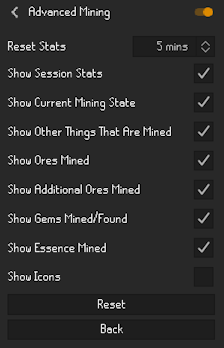

# Advanced Mining

A plugin based on the original mining plugin that will display exactly what type of ores/gems you have mined & what quantity. 
It also displays any minerals that you have managed to collect.

 
 

### Ores Supported
* Clay
* Copper
* Tin
* Iron
* Silver
* Coal
* Gold
* Mithril
* Adamantite
* Runite
* Amethyst

### Gems Supported
* Opal
* Jade
* Red Topaz
* Sapphire
* Emerald
* Ruby
* Diamond

### Others Supported
* Minerals
* Barronite Shards
* Barronite Deposits
* Blessed Bone Shards
* Calcified Deposits
* Dense Essence (Needs a better way to add it)
* Clue Geodes

### Updates
v.1.0.9 
* Some general bug fixes
* Added potential Prayer XP gained for mining Blessed Bone Shards.

v1.0.8 
* Added Barronite Shards & Deposits
* Changed the look slightly and given an option to turn of different things mined (see last picture above).

v1.0.7 
* Added Blessed Bone Shards.
* Added Calcified Deposits.
* Added respawn timers for Calcified Rocks.

v1.0.6 
* Bug fix on Dense Essence and added back the support for it.
* Added support for showing how many Clue Geodes you get per session.
* Plugin now auto disables the original Mining plugin if it's turned on.

Older Updates

v1.0.5 
Temporarily removed Dense Essence until fixed properly as it was showing up no matter what you mined.

v1.0.4 
* Added support for Dense Essence (needs a better method for adding it to the display).
* Updated the icon.
v1.0.3
* Given the option to just display the ore/gem icons instead on any text.
* Added Clay, Copper & Tin.

v1.0.2 
Fixed an error where it wasn't displaying gems found when mining.

v1.0.1 
Added more ore and gems collected to the display.

v1.0.0 
Initial release.

