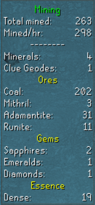
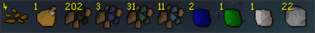
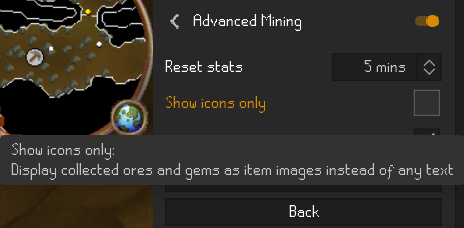

# Advanced Mining

[//]: # ([![Plugin Rank]&#40;http://img.shields.io/endpoint?url=https://i.pluginhub.info/shields/rank/plugin/advanced-mining&#41;]&#40;https://runelite.net/plugin-hub/show/advanced-mining&#41;)

A plugin based on the original mining plugin that will display exactly what type of ores/gems you have mined & what quantity. 
It also displays any minerals that you have managed to collect.

 
 

**Turn off the original mining plugin or it will display that and this one at the same time.**

### Ores Supported
* Clay
* Copper
* Tin
* Iron
* Silver
* Coal
* Gold
* Mithril
* Adamantite
* Runite
* Amethyst

### Gems Supported
* Opal
* Jade
* Red Topaz
* Sapphire
* Emerald
* Ruby
* Diamond

### Updates
v1.0.3
* Given the option to just display the ore/gem icons instead on any text.
* Added Clay, Copper & Tin.

v1.0.2 
Fixed an error where it wasn't displaying gems found when mining.

v1.0.1 
Added more ore and gems collected to the display.

v1.0.0 
Initial release.